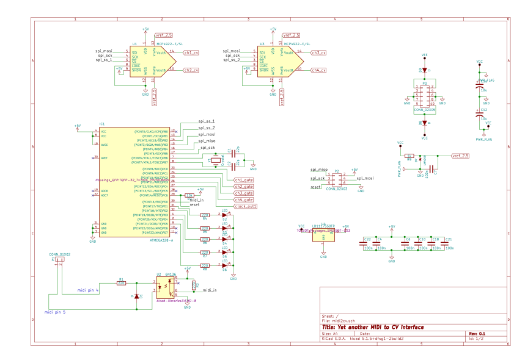
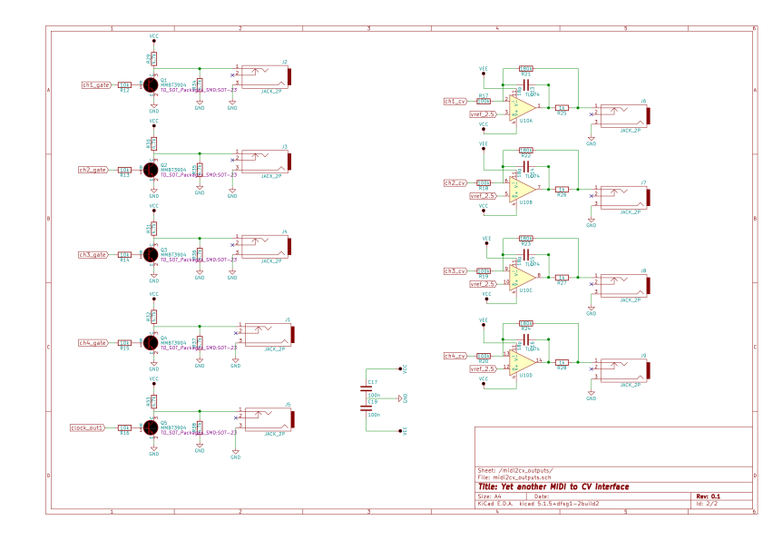

# old-midi2cv

PCB design + software for a midi2cv eurorack module.

I created it in 2016 and it has been installed in my rack since then.
It doesn't have any cool features and is probably really crappy, but it kind of works.

## Schematics

